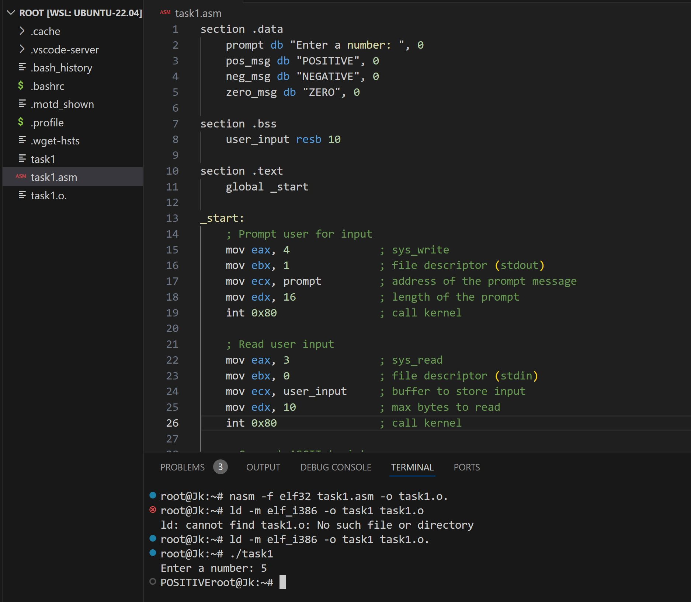
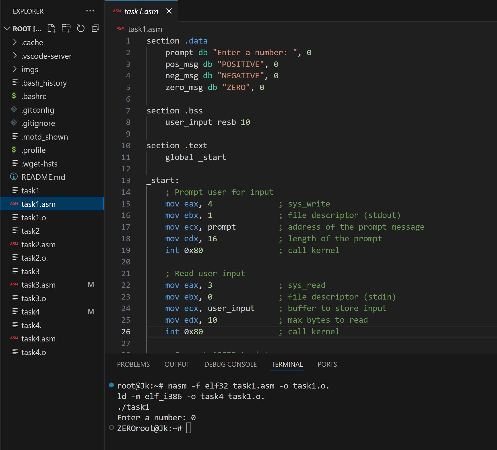
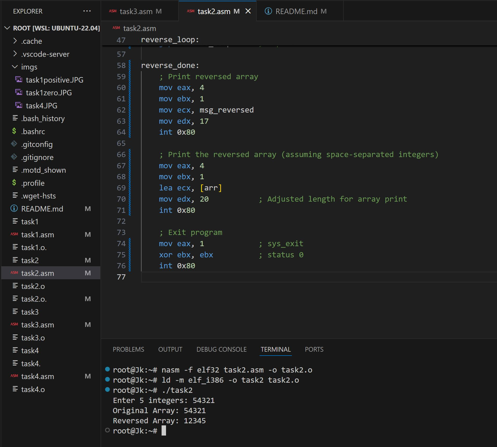
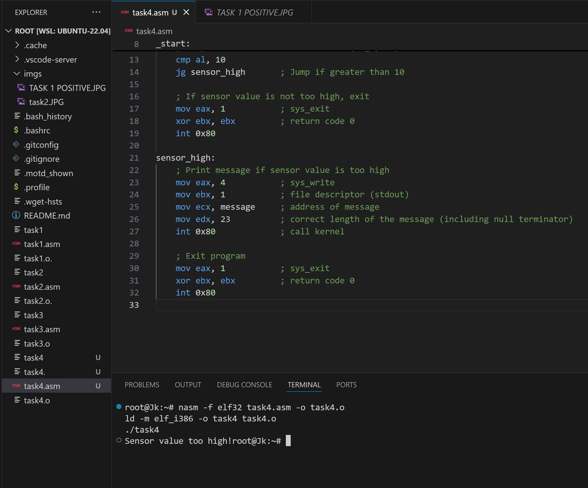

# ICS3203 CAT 2 - Assembly Programming

## Task 1: Control Flow and Conditional Logic
- **Purpose**: This program accepts an integer input and classifies it as positive, negative, or zero using conditional jumps.
- **Compiling and Running**:
  1. Assemble the code with `nasm -f elf32 task1.asm -o task1.o`
  2. Link the object file with `ld -m elf_i386 -o task1 task1.o`
  3. Run the program with `./task1`

## Task 2: Array Manipulation with Looping and Reversal
- **Purpose**: This program takes an array of integers, reverses it in place using loops, and prints the reversed array.
- **Compiling and Running**:
  1. Assemble the code with `nasm -f elf32 task2.asm -o task2.o`
  2. Link the object file with `ld -m elf_i386 -o task2 task2.o`
  3. Run the program with `./task2`

## Task 3: Modular Program for Factorial Calculation
- **Purpose**: Computes the factorial of a number using a recursive subroutine and stack-based register management.
- **Compiling and Running**:
  1. Assemble the code with `nasm -f elf32 task3.asm -o task3.o`
  2. Link the object file with `ld -m elf_i386 -o task3 task3.o`
  3. Run the program with `./task3`

## Task 4: Data Monitoring and Control Simulation
- **Purpose**: Simulates a control system for monitoring a sensor value (water level) and taking actions based on the input like turning a motor on/off.
- **Compiling and Running**:
  1. Assemble the code with `nasm -f elf32 task4.asm -o task4.o`
  2. Link the object file with `ld -m elf_i386 -o task4 task4.o`
  3. Run the program with `./task4`

## Images

Here are some screenshots to help visualize the tasks and their outputs:

### 1. Control Flow
- **Positive Input** 

    

- **Zero Input**  

  

### 2. Array Reversal

 

### 3. Factorial Calculation

 

### 4. Sensor Monitoring

 

## Challenges and Insights
- In Task 2, reversing the array in place without using extra memory was tricky but doable with loops and index manipulation.
- For Task 3, managing the stack and recursive calls made me more comfortable with modular programming in Assembly.
